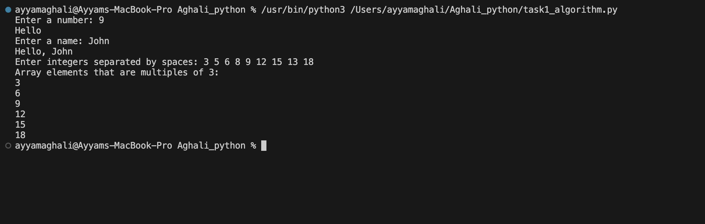

# Aghali_python

# 1. task_algorithm

A single Python script that performs three small algorithmic tasks in sequence:

1. **Number check**: Reads a number and prints “Hello” if it’s greater than 7.  
2. **Name check**: Reads a name and prints “Hello, John” if it matches `John`; otherwise, prints “There is no such name.”  
3. **Array filter**: Reads a space-separated list of integers and prints those divisible by 3.

## Algorithm

```python
def main():
    # Part 1: Number check
    try:
        n = int(input("Enter a number: "))
    except ValueError:
        print("That's not a valid integer.")
        return

    if n > 7:
        print("Hello")

    # Part 2: Name check
    name = input("Enter a name: ")
    if name == "John":
        print("Hello, John")
    else:
        print("There is no such name")

    # Part 3: Array of numbers
    raw = input("Enter integers separated by spaces: ")
    try:
        numbers = list(map(int, raw.split()))
    except ValueError:
        print("Please enter only integers.")
        return

    # Filter and print multiples of 3
    print("Array elements that are multiples of 3:")
    for x in numbers:
        if x % 3 == 0:
            print(x)


if __name__ == "__main__":
    main()```


## Screenshot of program output 




# 2.

# Given bracket sequence:  "[((())()(())]]"
## Can this sequence be considered correct? 
## If the answer to the previous question is “no”, then what needs to be changed in it to make it correct? 

## 1. No. In the second parenthesis-group, there are two “(” but three “)”, so at one point you have more closes than opens.

## 2. Remove the extra ')' so each opening parenthesis has a matching closer. For example:  [ ((())) (()) ]. Now every prefix has no more ) than (, and the total counts match.
